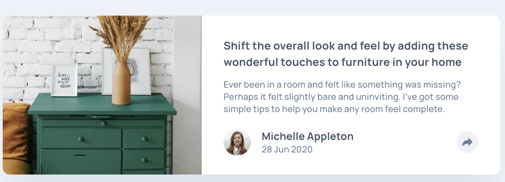
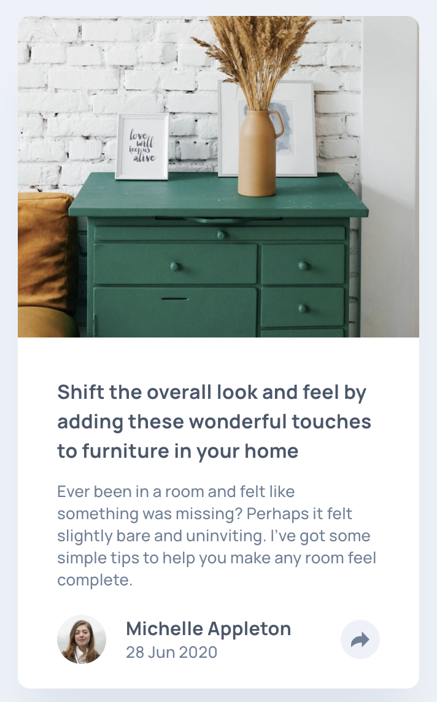
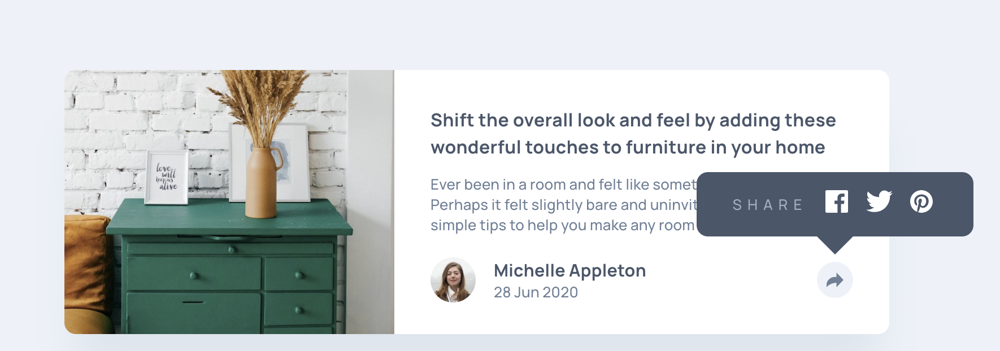

# Frontend Mentor - Article preview component solution

This is a solution to the [Article preview component challenge on Frontend Mentor](https://www.frontendmentor.io/challenges/article-preview-component-dYBN_pYFT).

## The challenge

The challenge is to build out this article preview component and get it looking as close to the design as possible.

Your users should be able to:

- View the optimal layout for the component depending on their device's screen size
- See the social media share links when they click the share icon

## Where to find everything

The task is to build out the project to the designs inside the `/design` folder. You can find both a mobile and a desktop version of the design.

You can find all the required assets in the `/images` folder. The assets are already optimized.

There is also a `style-guide.md` file containing the information, such as color palette and fonts.

### Screenshots

#### Desktop

  

#### Mobile

  

#### Active state

  

### Built with

- Semantic HTML5 markup
- CSS custom properties
- Flexbox
- Media queries
- JavaScript
- Visual Studio Code
